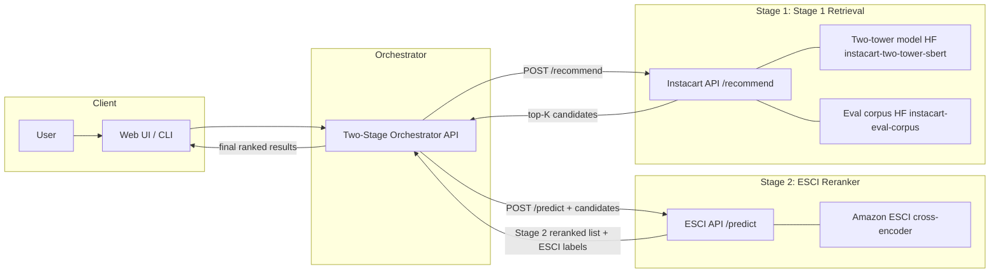

# Hybrid E-Commerce Search

This project wires two existing systems into a **two-stage search pipeline**: **Stage 1** (Stage 1 Retrieval, two-tower retriever) and **Stage 2** (ESCI reranker, Amazon cross-encoder). An orchestrator service calls both backends, joins results, and exposes a single `POST /search` endpoint. A React web UI visualizes retrieval vs reranked results side-by-side, with ESCI labels and rank movement. The pipeline illustrates the standard architecture used in production search (fast recall → precise rerank), even though the two models are trained on different datasets (Instacart grocery co-purchase vs Amazon product search).

Related repos: [instacart_next_order_recommendation](https://github.com/chen-bowen/instacart_next_order_recommendation), [Amazon_Multitask_Search_Ranking](https://github.com/chen-bowen/Amazon_Multitask_Search_Ranking).

**Contents:** [Quick start](#quick-start) · [Requirements](#requirements) · [Setup](#setup) · [How to use each component](#how-to-use-each-component) · [Pipeline](#pipeline) · [Architecture](#overall-architecture) · [API](#api) · [Web UI](#web-ui) · [Docker](#docker) · [Hugging Face Space](#hugging-face-space-docker) · [Backend API contracts](#backend-api-contracts) · [Limitations](#limitations) · [Project structure](#project-structure)

---

## Quick start

**Docker (recommended):**

```bash
./scripts/setup_deps.sh   # clones Stage 1 (Instacart) + Stage 2 (ESCI) into deps/
docker compose up --build
```

Open the app at `http://localhost:7860`. The gateway routes UI traffic to the frontend and `/api/*` to the orchestrator.

**Hugging Face Space:** The public demo is built from this repo’s **root** `Dockerfile` only (Spaces do not run `docker-compose.yml`). See [Hugging Face Space](#hugging-face-space-docker).

**Local dev:** `uv sync`, then start Stage 1 (Instacart, 8000) and Stage 2 (ESCI, 8001) from their repos, then `uv run uvicorn backend.main:app --host 0.0.0.0 --port 8080`. See [Pipeline](#pipeline) for details.

**What we're building:** Two-stage search (**Stage 1** retrieval → **Stage 2** reranking). Input: `user_id` or `user_context` + `query`. Output: ranked products with `rec_score`, `rerank_score`, `stage_2_label` (E/S/C/I). This repo orchestrates pre-trained services; it does not train models.

---

## Requirements

- **Python** 3.10+ (3.12 recommended; managed via `uv`).
- **Node.js** 18+ for the web UI (optional).
- **Stage 1 API (Stage 1 Retrieval)** running (from [instacart_next_order_recommendation](https://github.com/chen-bowen/instacart_next_order_recommendation) or `Instacart_Personalization` locally).
- **Stage 2 API (ESCI reranker)** running (from [Amazon_Multitask_Search_Ranking](https://github.com/chen-bowen/Amazon_Multitask_Search_Ranking) or `Amazon_Search_Retrieval` locally).
- **Disk:** Minimal; orchestrator and UI are lightweight. Models and data live in the upstream repos.

---

## Setup

1. **Clone this repo** and enter the project root.
2. **For Docker:** Follow [Docker](#docker) for the canonical setup and run commands.
3. **For local dev:** Install orchestrator deps with `uv sync`. Ensure Instacart and ESCI services are available (trained models and data in those repos). Run:
   - Instacart: `uv run uvicorn src.api.main:app --port 8000` (from the Instacart repo).
   - ESCI: `uv run uvicorn src.api.main:app --port 8001` (from the ESCI repo; ESCI runs on 8000 internally, map 8001:8000 if needed).
4. **Verify:** Start the orchestrator and call `POST /search`; it will return 502/503 if the backends are unreachable.
5. **Pre-commit (optional):** `uv run pre-commit install` to run hooks on git commit.

---

## How to use each component

| Component        | Command / Usage                                                                 | When to use                                                  |
| ---------------- | ------------------------------------------------------------------------------- | ------------------------------------------------------------ |
| **Orchestrator** | `uv run uvicorn backend.main:app --host 0.0.0.0 --port 8080`                    | Serve the two-stage search API                               |
| **Smoke script** | `uv run two-stage-search --user-id 3178496 --query "organic whole wheat bread"` | CLI smoke script for the search endpoint                     |
| **Web UI**       | `cd frontend && npm install && npm run dev`                                     | Interactive exploration; side-by-side and diff views         |
| **Docker**       | `./scripts/setup_deps.sh` then `docker compose up --build`                      | Run full stack (Stage 1, Stage 2, orchestrator, UI, gateway) |

**Typical workflow:** 1) Start Instacart and ESCI services → 2) Start orchestrator → 3) Use UI or smoke script to explore.

**Run unit tests:** `uv sync --extra dev && uv run pytest tests/ -v`

---

## Running the components locally

### 1. Start backends

**Instacart** (port 8000):

```bash
cd path/to/instacart_next_order_recommendation  # or Instacart_Personalization
uv run uvicorn src.api.main:app --host 0.0.0.0 --port 8000
```

**ESCI** (port 8001):

```bash
cd path/to/Amazon_Multitask_Search_Ranking  # or Amazon_Search_Retrieval
uv run uvicorn src.api.main:app --host 0.0.0.0 --port 8001
```

Note: ESCI runs on 8000 internally; expose it externally on 8001 for the orchestrator, or set `STAGE_2_URL=http://localhost:8001` when ESCI is on 8001.

### 2. Start orchestrator

```bash
cd Hybrid_Ecommerce_Search
uv sync
uv run uvicorn backend.main:app --host 0.0.0.0 --port 8080
```

### 3. Call the search endpoint

```bash
curl -X POST http://localhost:8080/search \
  -H "Content-Type: application/json" \
  -d '{
    "user_context": "[+7d w4h14] Organic Milk, Whole Wheat Bread.",
    "query": "organic whole wheat bread",
    "top_k_retrieve": 50,
    "top_k_final": 10
  }'
```

Or use the smoke test script:

```bash
uv run two-stage-search --user-id 3178496 --query "organic whole wheat bread"
```

---

## Overall Architecture



**Flow:** 1) User → orchestrator (query + user_id/user_context). 2) Orchestrator → **Stage 1 (Instacart)** `POST /recommend` → top-K candidates. 3) Orchestrator → **Stage 2 (ESCI)** `POST /predict` with query + candidates. 4) Stage 2 → reranked list with scores, ESCI labels, substitute flags. 5) Orchestrator → final ranked list.

---

## API

The orchestrator exposes the two-stage search endpoint and a Stage 1 proxy.

### Run locally

```bash
uv run uvicorn backend.main:app --host 0.0.0.0 --port 8080
```

**Environment variables:**

| Variable            | Description                                                         |
| ------------------- | ------------------------------------------------------------------- |
| `STAGE_1_URL`       | Stage 1 (Instacart) API base URL (default: `http://localhost:8000`) |
| `STAGE_2_URL`       | Stage 2 (ESCI) API base URL (default: `http://localhost:8001`)      |
| `INSTACART_API_KEY` | Optional API key for Stage 1 (Instacart) (`X-API-Key` header)       |
| `ESCI_API_KEY`      | Optional API key for Stage 2 (ESCI) (`X-API-Key` header)            |

### Endpoints

| Method | Path                | Description                                                  |
| ------ | ------------------- | ------------------------------------------------------------ |
| GET    | `/health`           | Liveness probe                                               |
| GET    | `/ready`            | Readiness probe                                              |
| POST   | `/search`           | Two-stage search (**Stage 1 + Stage 2**, see below)          |
| POST   | `/stage1/recommend` | Stage 1 only: proxy to Stage 1 (Instacart) `POST /recommend` |

### POST /search

**Request body:**

```json
{
  "user_id": "3178496",
  "query": "organic whole wheat bread",
  "top_k_retrieve": 50,
  "top_k_final": 10
}
```

Alternatively, provide `user_context` instead of `user_id`:

```json
{
  "user_context": "[+7d w4h14] Organic Milk, Whole Wheat Bread.",
  "query": "organic whole wheat bread",
  "top_k_retrieve": 50,
  "top_k_final": 10
}
```

| Field            | Type    | Required | Default | Description                                             |
| ---------------- | ------- | -------- | ------- | ------------------------------------------------------- |
| `user_id`        | string  | No       | —       | User ID resolvable via Stage 1 (Instacart) eval_queries |
| `user_context`   | string  | No       | —       | Full user context string for Stage 1 (Instacart)        |
| `query`          | string  | Yes      | —       | Search query for Stage 2 (ESCI) reranking               |
| `top_k_retrieve` | integer | No       | 50      | Number of candidates from Stage 1 (Instacart) (1–200)   |
| `top_k_final`    | integer | No       | 10      | Number of final results returned (1–100)                |

Either `user_id` or `user_context` is required.

**Response:**

```json
{
  "items": [
    {
      "product_id": "13517",
      "retrieval_rank": 1,
      "rec_score": 0.7639,
      "rerank_score": 0.9123,
      "stage_2_label": "E",
      "is_substitute": false,
      "product_text": "Product: Whole Wheat Bread. Aisle: bread. Department: bakery."
    }
  ],
  "stats": {
    "request_id": "...",
    "num_candidates": 50,
    "num_returned": 10,
    "purchase_history_used": "[+7d w4h14] Organic Milk, Whole Wheat Bread.",
    "stage_1_stats": { "total_latency_ms": 12.5, ... },
    "stage_2_stats": { "total_latency_ms": 45.2, ... },
    "total_latency_ms": 120.5
  }
}
```

- `stats.purchase_history_used`: Echo of the purchase-history / context string Stage 1 used for retrieval (from Stage 1’s response when available, otherwise falls back to the request’s `user_context`). The web UI shows this in the **Purchase history** panel.
- `retrieval_rank`: 1-based rank in Stage 1 (Instacart) order; used by the UI for rank movement.
- `rec_score`: Retrieval similarity from Instacart.
- `rerank_score`: Relevance score from ESCI.
- `stage_2_label`: E (Exact), S (Substitute), C (Complement), I (Irrelevant).

### curl examples

```bash
# Health check
curl http://localhost:8080/health
# {"status":"ok"}

# Search (Stage 1 + Stage 2) using user_id
curl -X POST http://localhost:8080/search \
  -H "Content-Type: application/json" \
  -d '{
    "user_id": "3178496",
    "query": "organic whole wheat bread",
    "top_k_retrieve": 20,
    "top_k_final": 10
  }'

# Search (Stage 1 + Stage 2) using purchase history directly
curl -X POST http://localhost:8080/search \
  -H "Content-Type: application/json" \
  -d '{
    "user_context": "[+7d w4h14] Organic Milk, Whole Wheat Bread.",
    "query": "organic whole wheat bread",
    "top_k_retrieve": 20,
    "top_k_final": 10
  }'

# Stage 1 only (Instacart retrieval)
curl -X POST http://localhost:8080/stage1/recommend \
  -H "Content-Type: application/json" \
  -d '{
    "user_id": "3178496",
    "query": "organic whole wheat bread",
    "top_k_retrieve": 20
  }'
```

---

## Backend API contracts

The orchestrator calls two backend services. Their exact request/response schemas are documented below.

### Stage 1 Retrieval API (Stage 1)

**Repository:** [instacart_next_order_recommendation](https://github.com/chen-bowen/instacart_next_order_recommendation) (or `Instacart_Personalization` locally)
**Base URL:** `http://localhost:8000` (default)
**Endpoint:** `POST /recommend`

**Request:**

Request:

| Field               | Type     | Required | Default | Description                                 |
| ------------------- | -------- | -------- | ------- | ------------------------------------------- |
| user_context        | string   | No       | null    | Full user context string (max 10,000 chars) |
| user_id             | string   | No       | null    | User ID resolvable via eval_queries.json    |
| top_k               | integer  | No       | 10      | Number of recommendations (1–100)           |
| exclude_product_ids | string[] | No       | []      | Product IDs to exclude                      |

Either `user_context` or `user_id` is required.

**Response:** `request_id`, `recommendations` (array of `{product_id, score, product_text}`), `stats` (optional: `total_latency_ms`, `query_embedding_time_ms`, `similarity_compute_time_ms`, `num_recommendations`, `top_score`, `avg_score`, `timestamp`), and optionally **`purchase_history_used`**: the resolved purchase-history / context string used to form the retrieval query (when implemented in your Stage 1 checkout; the orchestrator echoes this into `POST /search` `stats`).

**Authentication:** May require `X-API-Key` header.

### Amazon ESCI reranker API (Stage 2)

**Repository:** [Amazon_Multitask_Search_Ranking](https://github.com/chen-bowen/Amazon_Multitask_Search_Ranking) (or `Amazon_Search_Retrieval` locally)
**Base URL:** `http://localhost:8001` (default)
**Endpoint:** `POST /predict` (combined: ranking + ESCI class + substitute)

**Request:**

| Field        | Type            | Required | Description                  |
| ------------ | --------------- | -------- | ---------------------------- |
| `query`      | string          | Yes      | User search query            |
| `candidates` | CandidateItem[] | Yes      | List of `{product_id, text}` |

**Response:** `request_id`, `ranked` (array of `{product_id, score, stage_2_class, is_substitute}`), `stats` (`total_latency_ms`, `model_forward_time_ms`, `num_candidates`, `num_recommendations`, `device`, `top_score`, `avg_score`, `timestamp`).

**ESCI labels:** E (Exact), S (Substitute), C (Complement), I (Irrelevant).

**Authentication:** May require `X-API-Key` header.

### Orchestrator mapping

1. **Instacart → ESCI:** Convert `recommendations` to `candidates`: `product_id` → `product_id`, `product_text` (or `""` if null) → `text`.
2. **ESCI → Final response:** Join ESCI `ranked` with Instacart metadata by `product_id`: `rec_score` from Instacart, `rerank_score`, `stage_2_label`, `is_substitute` from ESCI, `product_text` from Instacart.
3. **Top-K:** Orchestrator applies `top_k_final` to the ESCI-ranked list before returning.
4. **Retrieval rank:** Each item includes `retrieval_rank` (1-based index in Instacart order) for UI rank movement.

---

## Web UI

A React/Vite web UI is available in `frontend/` for interactive exploration. Deployed from the **root** of this repository on [Hugging Face Space](https://huggingface.co/spaces/chenbowen184/hybrid-ecommerce-search)


### Run

```bash
cd frontend
npm install
npm run dev
```

Open [http://localhost:5173](http://localhost:5173). Configure the API URL (default: `http://localhost:8080`) in the sidebar.

### Features

- **Side-by-side view:** Stage 1 (Stage 1 Retrieval) vs Stage 2 (ESCI reranked)
- **Diff view:** Single list with rank movement (e.g. `#2 (was #7)`)
- **ESCI labels:** Color-coded badges (E=green, S=blue, C=orange, I=grey); labels come from `stage_2_label` on each result item.
- **Purchase history panel:** Shows `stats.purchase_history_used` from the orchestrator response when present.
- **Stats bar:** Latency breakdown for Instacart vs ESCI
- **Random user/query:** Quick buttons for sample inputs

---

## Docker

This repo supports two Docker deployment modes:

1. **Local multi-container (`docker-compose.yml`)**: Stage 1 API + Stage 2 API + orchestrator + frontend + gateway.
2. **Single-container runtime (`Dockerfile`)**: Hugging Face Docker Space-friendly image that runs nginx, Stage 1 API, Stage 2 API, orchestrator, and static frontend in one container.

`docker-compose.yml` and the root `Dockerfile` are intentionally different and optimized for these two environments.

**Gateway configs:**

| File | Used by | Role |
| ---- | ------- | ---- |
| `gateway/nginx.conf` | `docker compose` (`gateway` service) | Proxies to separate `frontend` and `orchestrator` containers on the compose network. |
| `gateway/nginx.hf.conf` | Root `Dockerfile` **runtime** stage | Single container: nginx listens on **7860**, serves the built React app from `/usr/share/nginx/html`, and proxies `/api/*`, `/docs`, `/redoc`, `/openapi.json`, `/health`, `/ready` to the orchestrator at **`127.0.0.1:8080`** (loopback avoids DNS/resolver issues in Hugging Face’s runtime). |

### A) Local multi-container (docker compose)

#### One-time setup

```bash
./scripts/setup_deps.sh
```

This clones [instacart_next_order_recommendation](https://github.com/chen-bowen/instacart_next_order_recommendation) and [Amazon_Multitask_Search_Ranking](https://github.com/chen-bowen/Amazon_Multitask_Search_Ranking) into `deps/stage-1` and `deps/stage-2` for compose builds.

**Stage 1 (Instacart) prerequisites** (in `deps/stage-1/`):

You can run Stage 1 in two ways: **HF-only (recommended for Docker)** or **local files**.

1. **Product corpus (candidate texts):**
   - **HF-only (recommended):** Ensure the public dataset [chenbowen184/instacart-eval-corpus](https://huggingface.co/datasets/chenbowen184/instacart-eval-corpus) exists and contains `eval_corpus.json` (the **product_eval_corpus**: a mapping of `product_id → product_text`). If it doesn't exist, run `uv run python -m src.data.prepare_instacart_sbert` to generate the corpus locally, then `uv run python scripts/upload_corpus_to_hf.py` from `deps/stage-1/`.
   - **Local:** Download the [Instacart dataset](https://www.kaggle.com/c/instacart-market-basket-analysis/data) into `data/`, then `uv run python -m src.data.prepare_instacart_sbert` → creates `processed/p5_mp20_ef0.1/eval_corpus.json`. Mount this into Docker via `INSTACART_PROCESSED` if you prefer not to use HF.
2. **Model (retriever):**
   - **HF-only (recommended):** Upload the trained two-tower model to a Hugging Face repo, e.g. [`chenbowen184/instacart-two-tower-sbert`](https://huggingface.co/chenbowen184/instacart-two-tower-sbert). The Docker compose file is configured to use this HF model ID as `MODEL_DIR`.
   - **Local:** Run training in `deps/stage-1/` with `uv run python -m src.training` → creates `models/two_tower_sbert/final/`, and set `MODEL_DIR=/app/models/two_tower_sbert/final` with a corresponding volume mount.

**Stage 2 (ESCI) prerequisites** (in `deps/stage-2/`): trained checkpoint at `checkpoints/multi_task_reranker/` (see that repo's README).

#### Build and run

By default, `docker-compose.yml` is wired to use **Hugging Face-only** for Stage 1:

- `MODEL_DIR=chenbowen184/instacart-two-tower-sbert` (retriever model)
- `CORPUS_HF_REPO=chenbowen184/product-artifacts` (dataset repo containing `eval_corpus.json`)
- `CORPUS_HF_REPO_TYPE=dataset`

Run with optional Hugging Face token (required only for private repos):

```bash
HF_TOKEN=your_hf_token docker compose up --build
```

If you prefer **local files** instead of HF, you can override the defaults, e.g.:

```bash
INSTACART_MODELS=./deps/stage-1/models \
INSTACART_PROCESSED=./deps/stage-1/processed \
MODEL_DIR=/app/models/two_tower_sbert/final \
CORPUS_HF_REPO="" \
docker compose up --build
```

#### Override for existing sibling repos

If you already have the backends cloned elsewhere:

```bash
INSTACART_CONTEXT=../Instacart_Personalization \
ESCI_CONTEXT=../Amazon_Search_Retrieval \
INSTACART_MODELS=../Instacart_Personalization/models \
INSTACART_PROCESSED=../Instacart_Personalization/processed \
INSTACART_DATA=../Instacart_Personalization/data \
ESCI_CHECKPOINTS=../Amazon_Search_Retrieval/checkpoints/multi_task_reranker \
docker compose up --build
```

#### Services (compose)

| Service      | Port          | Description                       |
| ------------ | ------------- | --------------------------------- |
| stage-1-api  | 8000          | Stage 1: Stage 1 Retrieval        |
| stage-2-api  | 8001          | Stage 2: ESCI reranker            |
| orchestrator | 8080          | Two-stage search API              |
| frontend     | 80 (internal) | React app served behind gateway   |
| gateway      | 7860          | Public entrypoint (UI + `/api/*`) |

Key routes when compose is running:

- `http://localhost:7860/` -> frontend UI
- `http://localhost:7860/api/search` -> orchestrator `POST /search`
- `http://localhost:8080/docs` -> orchestrator docs (direct)

### B) Single-container image (Hugging Face Docker Space)

The root `Dockerfile` provides two targets:

- `backend-runtime`: backend-only runtime for local compose orchestrator container.
- default final stage (`runtime`): Space-friendly runtime that serves everything behind nginx on port `7860`.

The final `runtime` stage:

- builds frontend assets (`frontend/`) and serves them as static files,
- starts Stage 1 and Stage 2 APIs from cloned deps repos in isolated venvs,
- starts the orchestrator on `8080`,
- runs nginx gateway on `7860`.

Build and run the single-container image locally:

```bash
docker build -t hybrid-search-space .
docker run --rm -p 7860:7860 -e HF_TOKEN=your_hf_token hybrid-search-space
```

If your Hugging Face repos are public, `HF_TOKEN` can be omitted.

### Hugging Face Space (Docker)

This Space is the **same codebase as the repo root**—deployment is **not** a nested copy of the app. A legacy `hf-space/` path may exist locally for experiments but is **gitignored** and is not what Hugging Face builds. The README YAML frontmatter at the top configures the Space (`sdk: docker`, `app_port: 7860`).

**What runs in one container**

1. Stage 1 API (Instacart retriever) on port **8000**
2. Stage 2 API (ESCI reranker) on port **8001**
3. Orchestrator (this repo’s `backend.main`) on port **8080**
4. **nginx** on port **7860** using `gateway/nginx.hf.conf` (static UI + reverse proxy). Static assets are served by nginx only—there is no separate Python `http.server` on port 80 (avoids port conflicts with nginx in a single container).

The container startup command also appends `orchestrator` and `frontend` to `/etc/hosts` as `127.0.0.1` for compatibility with older proxy hostnames; the current `nginx.hf.conf` proxies the API directly to **127.0.0.1:8080**.

**Environment**

- Spaces inject **`HF_TOKEN`** for gated or rate-limited Hub access. The image mirrors it to **`HUGGINGFACE_HUB_TOKEN`** for `huggingface_hub` / `transformers`.
- Recommended: set a token on the Space if you see slow downloads or “unauthenticated requests” warnings in logs.

**Cold start / 502 behavior**

- Stage 1 may spend **several minutes** on first boot downloading the corpus, model, and building the embedding index (see container logs: `Batches:` progress). Until nginx and the orchestrator are up together, you may see brief **502 Bad Gateway** responses—retry after the log shows Stage 1 **Application startup complete** and nginx is serving port 7860.

**API from the browser**

- UI: `https://<space>.hf.space/`
- Orchestrator via gateway: `POST .../api/search` (rewritten to orchestrator `/search`), or `GET .../health` for a quick check.

---

## Limitations

- **Domain mismatch:** Instacart is trained on grocery co-purchase behavior; ESCI is trained on Amazon product search relevance. This pipeline combines two public benchmarks to illustrate the architecture. In production, both stages would be trained or fine-tuned on the same platform's data.
- **API key:** If Instacart or ESCI require `X-API-Key`, set `INSTACART_API_KEY` and `ESCI_API_KEY` in the orchestrator environment.
- **No training:** This repo does not train models; it orchestrates existing services.

**Future work:** Train both stages on a unified dataset; integrate online metrics (CTR, conversion) for evaluation.

---

## Project structure

| Path                            | Description                                                                    |
| ------------------------------- | ------------------------------------------------------------------------------ |
| **backend/**                    | FastAPI orchestrator: `main.py`, `schemas.py`                                  |
| **frontend/**                   | React/Vite web UI: query form, side-by-side and diff views, stats bar          |
| **backend/two_stage_search.py** | CLI smoke script for `POST /search` (run: `uv run two-stage-search`)           |
| **scripts/setup_deps.sh**       | Clone Instacart + ESCI repos into `deps/` for Docker                           |
| **tests/**                      | Unit tests (e.g. `tests/test_schemas.py`)                                      |
| **Dockerfile**                  | Multi-stage image: `backend-runtime` for compose orchestrator + default `runtime` for HF Space (nginx + all APIs) |
| **docker-compose.yml**          | Local multi-container stack: Stage 1, Stage 2, orchestrator, frontend, gateway |
| **gateway/nginx.conf**          | nginx config for **docker compose** (multi-service proxy)                       |
| **gateway/nginx.hf.conf**       | nginx config for **HF Space** single-container (static UI + proxy to `127.0.0.1:8080`) |
| **pyproject.toml**, **uv.lock** | Project and dependency lock (uv)                                               |

---

## License

MIT. Use of the Instacart and Amazon ESCI datasets is subject to their respective terms.
