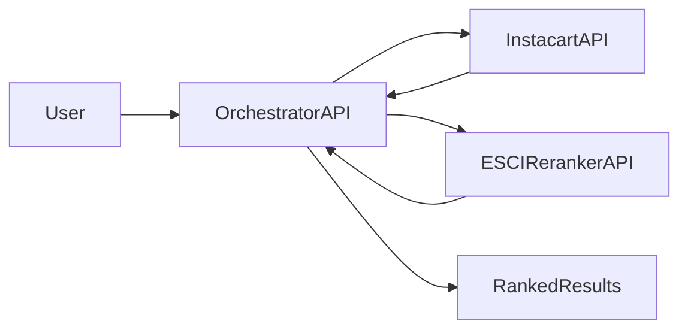

# Hybrid E-Commerce Search

This project wires two existing systems into a **two-stage search pipeline**: a two-tower Instacart retriever (Stage 1) and an Amazon ESCI cross-encoder reranker (Stage 2). An orchestrator service calls both backends, joins results, and exposes a single `POST /search` endpoint. A React web UI visualizes retrieval vs reranked results side-by-side, with ESCI labels and rank movement. The pipeline illustrates the standard architecture used in production search (fast recall → precise rerank), even though the two models are trained on different datasets (Instacart grocery co-purchase vs Amazon product search).

Related repos: [instacart_next_order_recommendation](https://github.com/chen-bowen/instacart_next_order_recommendation), [Amazon_Multitask_Search_Ranking](https://github.com/chen-bowen/Amazon_Multitask_Search_Ranking).

**Contents:** [Quick start](#quick-start) · [Requirements](#requirements) · [Setup](#setup) · [How to use each component](#how-to-use-each-component) · [Pipeline](#pipeline) · [Architecture](#overall-architecture) · [API](#api) · [Web UI](#web-ui) · [Docker](#docker) · [Backend API contracts](#backend-api-contracts) · [Limitations](#limitations) · [Project structure](#project-structure)

---

## Quick start

**Docker (recommended):**

```bash
./scripts/setup_deps.sh   # clones Instacart + ESCI into deps/
docker compose up --build
```

**Local dev:** `uv sync`, then start Instacart (8000) and ESCI (8001) from their repos, then `uv run uvicorn backend.main:app --host 0.0.0.0 --port 8080`. See [Pipeline](#pipeline) for details.

**What we're building:** Two-stage search (Instacart retrieval → ESCI reranking). Input: `user_id` or `user_context` + `query`. Output: ranked products with `rec_score`, `rerank_score`, `esci_label` (E/S/C/I). This repo orchestrates pre-trained services; it does not train models.

---

## Requirements

- **Python** 3.10+ (3.12 recommended; managed via `uv`).
- **Node.js** 18+ for the web UI (optional).
- **Instacart API** running (from [instacart_next_order_recommendation](https://github.com/chen-bowen/instacart_next_order_recommendation) or `Instacart_Personalization` locally).
- **ESCI API** running (from [Amazon_Multitask_Search_Ranking](https://github.com/chen-bowen/Amazon_Multitask_Search_Ranking) or `Amazon_Search_Retrieval` locally).
- **Disk:** Minimal; orchestrator and UI are lightweight. Models and data live in the upstream repos.

---

## Setup

1. **Clone this repo** and enter the project root.
2. **For Docker:** Run `./scripts/setup_deps.sh` to clone the backend repos into `deps/`.
3. **For local dev:** Install orchestrator deps with `uv sync`. Ensure Instacart and ESCI services are available (trained models and data in those repos). Run:
   - Instacart: `uv run uvicorn src.api.main:app --port 8000` (from the Instacart repo).
   - ESCI: `uv run uvicorn src.api.main:app --port 8001` (from the ESCI repo; ESCI runs on 8000 internally, map 8001:8000 if needed).
4. **Verify:** Start the orchestrator and call `POST /search`; it will return 502/503 if the backends are unreachable.

---

## How to use each component


| Component        | Command / Usage                                                                                   | When to use                                            |
| ---------------- | ------------------------------------------------------------------------------------------------- | ------------------------------------------------------ |
| **Orchestrator** | `uv run uvicorn backend.main:app --host 0.0.0.0 --port 8080`                                      | Serve the two-stage search API                         |
| **Smoke script** | `uv run two-stage-search --user-id 3178496 --query "organic whole wheat bread"`                  | CLI smoke script for the search endpoint               |
| **Web UI**       | `cd frontend && npm install && npm run dev`                                                      | Interactive exploration; side-by-side and diff views   |
| **Docker**       | `./scripts/setup_deps.sh` then `docker compose up --build`                                         | Run all three services (Instacart, ESCI, orchestrator) |


**Typical workflow:** 1) Start Instacart and ESCI services → 2) Start orchestrator → 3) Use UI or smoke script to explore.

**Run unit tests:** `uv sync --extra dev && uv run pytest tests/ -v`

---

## Running the components locally

### 1. Start backends

**Instacart** (port 8000):

```bash
cd path/to/instacart_next_order_recommendation  # or Instacart_Personalization
uv run uvicorn src.api.main:app --host 0.0.0.0 --port 8000
```

**ESCI** (port 8001):

```bash
cd path/to/Amazon_Multitask_Search_Ranking  # or Amazon_Search_Retrieval
uv run uvicorn src.api.main:app --host 0.0.0.0 --port 8001
```

Note: ESCI runs on 8000 internally; expose it externally on 8001 for the orchestrator, or set `ESCI_URL=http://localhost:8001` when ESCI is on 8001.

### 2. Start orchestrator

```bash
cd Hybrid_Ecommerce_Search
uv sync
uv run uvicorn backend.main:app --host 0.0.0.0 --port 8080
```

### 3. Call the search endpoint

```bash
curl -X POST http://localhost:8080/search \
  -H "Content-Type: application/json" \
  -d '{"user_id": "3178496", "query": "organic whole wheat bread", "top_k_retrieve": 50, "top_k_final": 10}'
```

Or use the smoke test script:

```bash
uv run two-stage-search --user-id 3178496 --query "organic whole wheat bread"
```

---

## Overall Architecture




**Flow:** 1) User → orchestrator (query + user_id/user_context). 2) Orchestrator → Instacart `POST /recommend` → top-K candidates. 3) Orchestrator → ESCI `POST /predict` with query + candidates. 4) ESCI → reranked list with scores, ESCI labels, substitute flags. 5) Orchestrator → final ranked list.

---

## API

The orchestrator exposes a single search endpoint.

### Run locally

```bash
uv run uvicorn backend.main:app --host 0.0.0.0 --port 8080
```

**Environment variables:**


| Variable            | Description                                               |
| ------------------- | --------------------------------------------------------- |
| `INSTACART_URL`     | Instacart API base URL (default: `http://localhost:8000`) |
| `ESCI_URL`          | ESCI API base URL (default: `http://localhost:8001`)      |
| `INSTACART_API_KEY` | Optional API key for Instacart (`X-API-Key` header)       |
| `ESCI_API_KEY`      | Optional API key for ESCI (`X-API-Key` header)            |


### Endpoints


| Method | Path      | Description                  |
| ------ | --------- | ---------------------------- |
| GET    | `/health` | Liveness probe               |
| GET    | `/ready`  | Readiness probe              |
| POST   | `/search` | Two-stage search (see below) |


### POST /search

**Request body:**

```json
{
  "user_id": "3178496",
  "query": "organic whole wheat bread",
  "top_k_retrieve": 50,
  "top_k_final": 10
}
```

Alternatively, provide `user_context` instead of `user_id`:

```json
{
  "user_context": "[+7d w4h14] Organic Milk, Whole Wheat Bread.",
  "query": "organic whole wheat bread",
  "top_k_retrieve": 50,
  "top_k_final": 10
}
```


| Field            | Type    | Required | Default | Description                                   |
| ---------------- | ------- | -------- | ------- | --------------------------------------------- |
| `user_id`        | string  | No       | —       | User ID resolvable via Instacart eval_queries |
| `user_context`   | string  | No       | —       | Full user context string for Instacart        |
| `query`          | string  | Yes      | —       | Search query for ESCI reranking               |
| `top_k_retrieve` | integer | No       | 50      | Number of candidates from Instacart (1–200)   |
| `top_k_final`    | integer | No       | 10      | Number of final results returned (1–100)      |


Either `user_id` or `user_context` is required.

**Response:**

```json
{
  "items": [
    {
      "product_id": "13517",
      "retrieval_rank": 1,
      "rec_score": 0.7639,
      "rerank_score": 0.9123,
      "esci_label": "E",
      "is_substitute": false,
      "product_text": "Product: Whole Wheat Bread. Aisle: bread. Department: bakery."
    }
  ],
  "stats": {
    "request_id": "...",
    "num_candidates": 50,
    "num_returned": 10,
    "instacart_stats": { "total_latency_ms": 12.5, ... },
    "esci_stats": { "total_latency_ms": 45.2, ... },
    "total_latency_ms": 120.5
  }
}
```

- `retrieval_rank`: 1-based rank in Stage 1 (Instacart) order; used by the UI for rank movement.
- `rec_score`: Retrieval similarity from Instacart.
- `rerank_score`: Relevance score from ESCI.
- `esci_label`: E (Exact), S (Substitute), C (Complement), I (Irrelevant).

### curl examples

```bash
# Health check
curl http://localhost:8080/health
# {"status":"ok"}

# Search
curl -X POST http://localhost:8080/search \
  -H "Content-Type: application/json" \
  -d '{"user_id": "3178496", "query": "organic whole wheat bread", "top_k_retrieve": 20, "top_k_final": 10}'
```

---

## Backend API contracts

The orchestrator calls two backend services. Their exact request/response schemas are documented below.

### Instacart retrieval API (Stage 1)

**Repository:** [instacart_next_order_recommendation](https://github.com/chen-bowen/instacart_next_order_recommendation) (or `Instacart_Personalization` locally)  
**Base URL:** `http://localhost:8000` (default)  
**Endpoint:** `POST /recommend`

**Request:**

| Field                 | Type     | Required | Default | Description                       |
| --------------------- | -------- | -------- | ------- | --------------------------------- | ------------------------------------------- |
| `user_context`        | string   | null     | No    | null                              | Full user context string (max 10,000 chars) |
| `user_id`             | string   | null     | No    | null                              | User ID resolvable via eval_queries.json    |
| `top_k`               | integer  | No       | 10      | Number of recommendations (1–100) |
| `exclude_product_ids` | string[] | No       | []      | Product IDs to exclude            |

Either `user_context` or `user_id` is required.

**Response:** `request_id`, `recommendations` (array of `{product_id, score, product_text}`), `stats` (optional: `total_latency_ms`, `query_embedding_time_ms`, `similarity_compute_time_ms`, `num_recommendations`, `top_score`, `avg_score`, `timestamp`).

**Authentication:** May require `X-API-Key` header.

### Amazon ESCI reranker API (Stage 2)

**Repository:** [Amazon_Multitask_Search_Ranking](https://github.com/chen-bowen/Amazon_Multitask_Search_Ranking) (or `Amazon_Search_Retrieval` locally)  
**Base URL:** `http://localhost:8001` (default)  
**Endpoint:** `POST /predict` (combined: ranking + ESCI class + substitute)

**Request:**


| Field        | Type            | Required | Description                  |
| ------------ | --------------- | -------- | ---------------------------- |
| `query`      | string          | Yes      | User search query            |
| `candidates` | CandidateItem[] | Yes      | List of `{product_id, text}` |


**Response:** `request_id`, `ranked` (array of `{product_id, score, esci_class, is_substitute}`), `stats` (`total_latency_ms`, `model_forward_time_ms`, `num_candidates`, `num_recommendations`, `device`, `top_score`, `avg_score`, `timestamp`).

**ESCI labels:** E (Exact), S (Substitute), C (Complement), I (Irrelevant).

**Authentication:** May require `X-API-Key` header.

### Orchestrator mapping

1. **Instacart → ESCI:** Convert `recommendations` to `candidates`: `product_id` → `product_id`, `product_text` (or `""` if null) → `text`.
2. **ESCI → Final response:** Join ESCI `ranked` with Instacart metadata by `product_id`: `rec_score` from Instacart, `rerank_score`, `esci_label`, `is_substitute` from ESCI, `product_text` from Instacart.
3. **Top-K:** Orchestrator applies `top_k_final` to the ESCI-ranked list before returning.
4. **Retrieval rank:** Each item includes `retrieval_rank` (1-based index in Instacart order) for UI rank movement.

---

## Web UI

A React/Vite web UI is available in `frontend/` for interactive exploration.

### Run

```bash
cd frontend
npm install
npm run dev
```

Open [http://localhost:5173](http://localhost:5173). Configure the API URL (default: `http://localhost:8080`) in the sidebar.

### Features

- **Side-by-side view:** Stage 1 (Instacart retrieval) vs Stage 2 (ESCI reranked)
- **Diff view:** Single list with rank movement (e.g. `#2 (was #7)`)
- **ESCI labels:** Color-coded badges (E=green, S=blue, C=orange, I=grey)
- **Stats bar:** Latency breakdown for Instacart vs ESCI
- **Random user/query:** Quick buttons for sample inputs

---

## Docker

This repo is a **meta-repo**: it orchestrates the pipeline and pulls in the backend repos on demand.

### One-time setup

```bash
./scripts/setup_deps.sh
```

This clones [instacart_next_order_recommendation](https://github.com/chen-bowen/instacart_next_order_recommendation) and [Amazon_Multitask_Search_Ranking](https://github.com/chen-bowen/Amazon_Multitask_Search_Ranking) into `deps/instacart` and `deps/esci`. You must have trained models and data in those repos (see their READMEs).

### Build and run

```bash
docker compose up --build
```

### Override for existing sibling repos

If you already have the backends cloned elsewhere:

```bash
INSTACART_CONTEXT=../Instacart_Personalization \
ESCI_CONTEXT=../Amazon_Search_Retrieval \
INSTACART_MODELS=../Instacart_Personalization/models \
INSTACART_PROCESSED=../Instacart_Personalization/processed \
INSTACART_DATA=../Instacart_Personalization/data \
ESCI_CHECKPOINTS=../Amazon_Search_Retrieval/checkpoints/multi_task_reranker \
docker compose up --build
```

### Services


| Service       | Port | Description                      |
| ------------- | ---- | -------------------------------- |
| instacart-api | 8000 | Instacart retrieval              |
| esci-api      | 8001 | ESCI reranker (mapped from 8000) |
| orchestrator  | 8080 | Two-stage search API             |


---

## Limitations

- **Domain mismatch:** Instacart is trained on grocery co-purchase behavior; ESCI is trained on Amazon product search relevance. This pipeline combines two public benchmarks to illustrate the architecture. In production, both stages would be trained or fine-tuned on the same platform's data.
- **API key:** If Instacart or ESCI require `X-API-Key`, set `INSTACART_API_KEY` and `ESCI_API_KEY` in the orchestrator environment.
- **No training:** This repo does not train models; it orchestrates existing services.

**Future work:** Train both stages on a unified dataset; integrate online metrics (CTR, conversion) for evaluation.

---

## Project structure


| Path                            | Description                                                           |
| ------------------------------- | --------------------------------------------------------------------- |
| **backend/**                    | FastAPI orchestrator: `main.py`, `schemas.py`                         |
| **frontend/**                   | React/Vite web UI: query form, side-by-side and diff views, stats bar |
| **backend/two_stage_search.py** | CLI smoke script for `POST /search` (run: `uv run two-stage-search`) |
| **scripts/setup_deps.sh**      | Clone Instacart + ESCI repos into `deps/` for Docker                 |
| **tests/**                     | Unit tests (e.g. `tests/test_schemas.py`)                           |
| **Dockerfile**                  | Multi-stage build for orchestrator (uv)                               |
| **docker-compose.yml**          | Instacart, ESCI, orchestrator services                                |
| **pyproject.toml**, **uv.lock** | Project and dependency lock (uv)                                      |


---

## License

MIT. Use of the Instacart and Amazon ESCI datasets is subject to their respective terms.